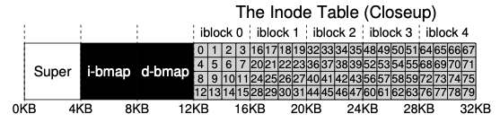

## TinyFS
TinyFS is a small and simple FUSE based filesystem created mainly for educational purposes and has no ambition of
becoming a production ready filesystem. TinyFS will be implemented in Rust.

### Goals
- Support **mkfs** to create the disk layout
- Support the following file operations
  - **open** filename flag
  - **read** fd size
  - **write** fd string
  - **seek** fd offset
  - **close** fd
  - **mkdir** dirname
  - **rmdir** dirname
  - **cd** dirname
  - **ls**
  - **cat**
  - **tree**


### Non Goals
- Support Journaling
- Supporting large files
- Becoming a distributed filesystem


## Design

### Disk Layout

TinyFS formats the disk into 4kb  blocks and will have 64 blocks in total, which means that TinyFS requires a disk with
256mb free space. The first block will be used for the superblock, the next two blocks will be used for inode and data
bitmap tables respectively and the following 5 blocks are used for inodes.

<figure>



<figcaption align="center">TinyFS Disk Layout</figcaption>

</figure>

The disk layout above means that the first 8 blocks are used for managing the filesystem and the remaining 56 blocks are
used for actual data storage.

### Datastructures

#### Superblock

Superblock contains metadata about the filesystem. TinyFS reads the superblock on initialization to know things like
how much disk space is remaing.

```
Superblock
  block_size int
  block_count int
```

#### Bitmaps

A bitmap is an array of bytes used to indicate whether the corresponding block is free or allocated. Each bit in the array
maps to a corresponding block. Bit 0 maps to block 0, bit 1 maps to block 1 so on and so forth.

```
  Bitmap
   []byte
```

#### Inodes

Inodes hold file metadata and represent both files and directories

```
  Inode
    mode int
    uid int
    gid int
    size int
    created_at Time
    modified_at Time
    deleted_at Time
    flags byte
    hard_links int
    direct_blocks []int
    indirect_block []int
    double_indirect_block []int
```


#### Data Blocks

Datablocks have no particular structure and hold the actual file data.

## Implementation

[mkfs](./mkfs.md)

## Notes
Before mounting the FS, make sure that the directory exists ie `mkdir /tmp/tiny`

To unmount the fs, `fusermount -u /tmp/tiny`

When permissions are denied use `sudo addgroup <USERNAME> fuse`

## References

[Filesystem Implementation](https://pages.cs.wisc.edu/~remzi/OSTEP/file-implementation.pdf)
